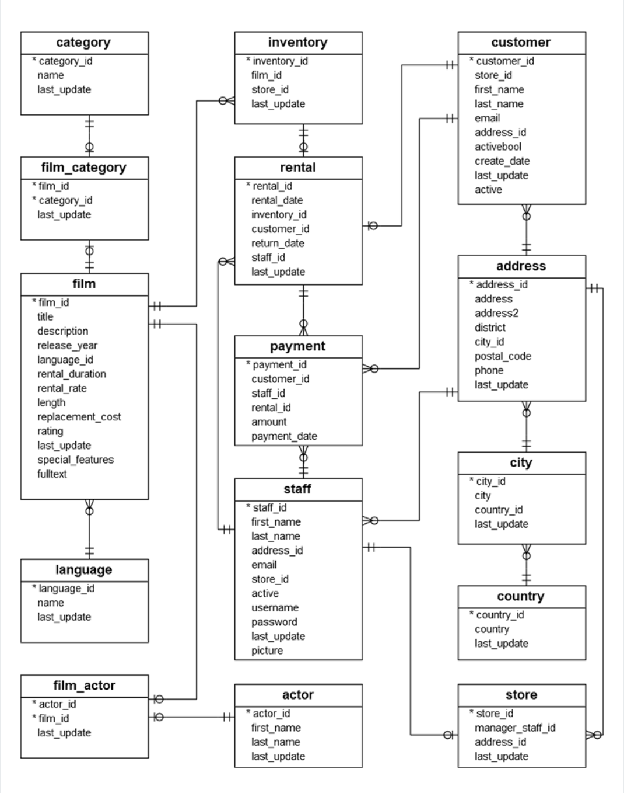

# Spring Boot Demo Project

Execute below command will to trigger docker containers, before starting spring boot application. 
```shell
docker-compose up
```

### Swagger Doc
http://localhost:9000/swagger-ui/index.html

### #TODO
1. Spring Transactional Annotation
2. Builder Annotation
3. Tests
4. Kafka Implementation 
5. Setting up JPA.


### Access Kafka UI
http://localhost:8090/


